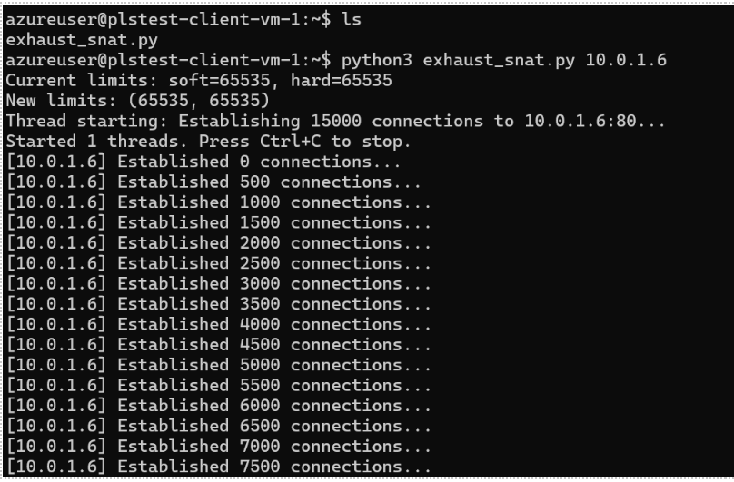
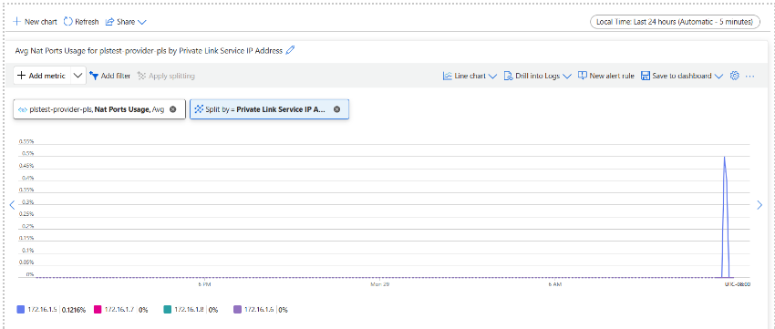

# Azure Private Link Service - SNAT Port Exhaustion Testing

This repository contains infrastructure as code and testing scripts to demonstrate Azure Private Link Service (PLS) and SNAT port exhaustion scenarios.

## Overview

Azure Private Link Service enables you to privately provide your own services—such as line-of-business applications or partner offerings—to consumers within Azure. With Private Link Service, you expose your service behind a standard load balancer and allow clients in other virtual networks or even in other Azure tenants to access it securely over a private endpoint, keeping all traffic on the Microsoft backbone network.

### Key Concepts

**Private Link Service (PLS)**: Used to privately offer your own service to other Azure consumers.

**Private Endpoint**: Used to securely connect to Azure PaaS solutions (such as databases or storage accounts) within your virtual network.

## Architecture

The setup comprises two distinct virtual networks with no direct connectivity:


### Client VNET
- Contains two Linux virtual machines (VMs)
- Hosts four Private Endpoints
- Each Private Endpoint connects to the PLS in the Provider VNET

### Provider VNET
- Deploys Azure Private Link Service (PLS)
- Azure Load Balancer with backend pool on port 80
- PLS configured with four NAT IP addresses
- Backend pool with Linux VM running NGINX

## Prerequisites

- Azure subscription
- Azure CLI installed
- Basic understanding of Azure networking
- SSH client

## Getting Started

For detailed deployment instructions, see the [Lab Instructions](./instructions.md).

### Retrieve Credentials

```bash
# Get Key Vault name from deployment outputs
KV_NAME=$(az deployment group show \
  --resource-group rg-pls-demo \
  --name main \
  --query "properties.outputs.keyVaultName.value" -o tsv)

# Retrieve username and password
USERNAME=$(az keyvault secret show --vault-name $KV_NAME --name clientVm1-username --query 'value' -o tsv)
PASSWORD=$(az keyvault secret show --vault-name $KV_NAME --name clientVm1-password --query 'value' -o tsv)

echo "Username: $USERNAME"
echo "Password: $PASSWORD"
```

> **Note**: You must have the "Key Vault Secret User" role to access secrets.

### Test Connectivity

```bash
# Get the public IP of Client VM 1
CLIENT_VM_IP=$(az deployment group show \
  --resource-group rg-pls-demo \
  --name main \
  --query "properties.outputs.clientVm1PublicIp.value" -o tsv)

# SSH to the client VM
ssh $USERNAME@$CLIENT_VM_IP

# Test connectivity to Private Endpoint
# Get the Private Endpoint IP (typically 10.0.1.4, 10.0.1.5, etc.)
curl http://10.0.1.4
```

If the setup is correct, you should receive an NGINX response.


## Testing SNAT Port Exhaustion

### Understanding SNAT Port Exhaustion

Each NAT IP address configured in the PLS supports up to **64,000 concurrent flows**. When connections exceed this limit, new attempts may time out due to SNAT port exhaustion.

#### NAT IP Scaling
- Configure up to 8 NAT IP addresses per PLS
- Each NAT IP provides 64,000 additional concurrent flows
- Total capacity: 8 × 64,000 = 512,000 concurrent flows

### Running the Exhaustion Test

The `exhaust_snat.py` script generates a large volume of persistent connections:

```bash
# SSH to the client VM
ssh $USERNAME@$CLIENT_VM_IP

# Run the SNAT exhaustion script
# Syntax: python3 exhaust_snat.py <PE_IP> <PORT> <CONNECTIONS>
python3 /home/azureuser/exhaust_snat.py 10.0.1.4 80 60000

# Run in background
nohup python3 /home/azureuser/exhaust_snat.py 10.0.1.4 80 60000 > /tmp/exhaust.log 2>&1 &

# Monitor active connections
ss -tn dst 10.0.1.4 | grep ESTAB | wc -l
```



### Monitoring SNAT Port Usage

1. Navigate to Azure Portal
2. Select your **Private Link Service** resource
3. Go to **Monitoring** → **Metrics**
4. Select metric: **NAT port usage**
5. Apply **Splitting** by NAT IP address

This visualizes SNAT port consumption per NAT IP, helping identify exhaustion patterns.



## Repository Structure

```
.
├── docs/
│   ├── README.md              # This file
│   ├── instructions.md        # Detailed step-by-step guide
│   └── images/                # Architecture diagrams and screenshots
├── infra/
│   ├── main.bicep            # Main Bicep template
│   ├── main.bicepparam       # Parameters file
│   └── modules/              # Bicep modules
├── exhaust_snat.py           # SNAT exhaustion testing script
└── tcp_flood.sh              # Additional testing script
```

## Key Resources

- [Azure Private Link Service Documentation](https://learn.microsoft.com/azure/private-link/private-link-service-overview)
- [Private Link Service NAT IP Configuration](https://learn.microsoft.com/azure/private-link/private-link-service-overview#nat-ip-configuration)
- [Monitoring Private Link Service](https://learn.microsoft.com/azure/private-link/private-link-service-overview#metrics)

## Troubleshooting

### SSH Connection Issues
- Ensure NSGs allow port 22
- Verify you have the correct public IP
- Check Key Vault access permissions

### Connectivity Issues
- Verify Private Endpoint status
- Check Load Balancer health probe
- Ensure backend VM NGINX is running: `sudo systemctl status nginx`

### SNAT Exhaustion Not Occurring
- Increase connection count in script
- Run script on multiple client VMs simultaneously
- Verify NAT IP configuration on PLS

## Contributing

Contributions are welcome! Please feel free to submit issues or pull requests.

## License

This project is provided as-is for demonstration purposes.
